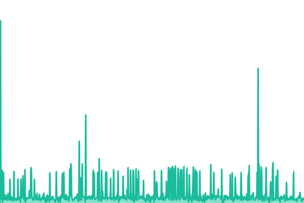
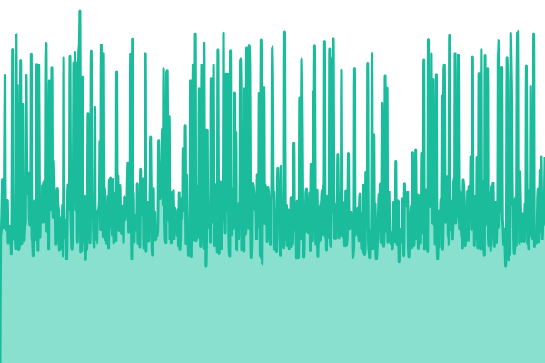
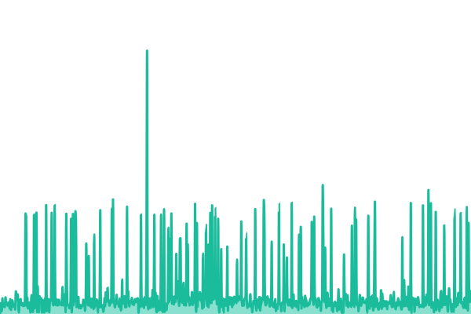
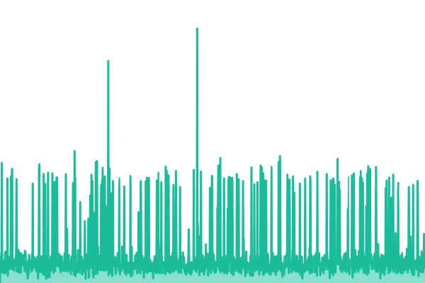
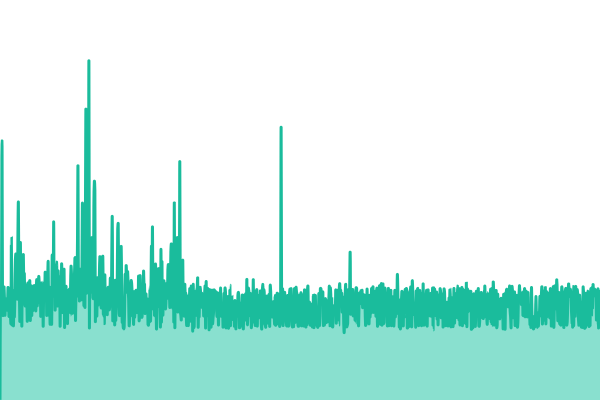
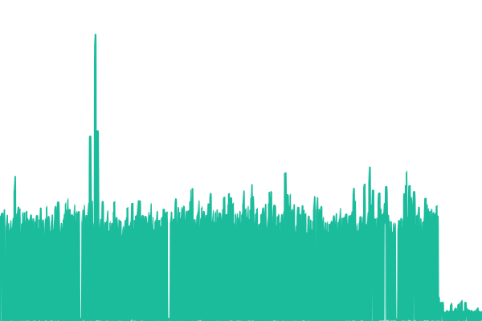
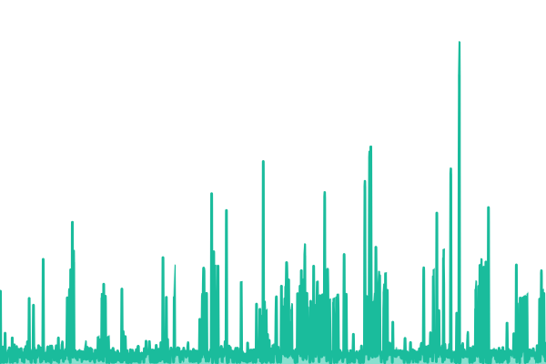

# [📈 Live Status](https://index.ba): <!--live status--> **🟩 All systems operational**

This repository contains the open-source uptime monitor and status page for [Index](https://index.ba), powered by [Upptime](https://github.com/upptime/upptime).

With [Upptime](https://upptime.js.org), you can get your own unlimited and free uptime monitor and status page, powered entirely by a GitHub repository. We use [Issues](https://github.com/Index-Interactive/Status/issues) as incident reports, [Actions](https://github.com/Index-Interactive/Status/actions) as uptime monitors, and [Pages](https://index.ba) for the status page.

<!--start: status pages-->
<!-- This summary is generated by Upptime (https://github.com/upptime/upptime) -->
<!-- Do not edit this manually, your changes will be overwritten -->
<!-- prettier-ignore -->
| URL | Status | History | Response Time | Uptime |
| --- | ------ | ------- | ------------- | ------ |
|  [Index.ba](https://index.ba) | 🟩 Up | [index-ba.yml](https://github.com/IndexBH/Status/commits/HEAD/history/index-ba.yml) | 

 590ms
     
 | 

<a href="https://upptime.status.index.ba/history/index-ba">100.00%</a>
    

|  [Index.ba Status](https://status.index.ba) | 🟩 Up | [index-ba-status.yml](https://github.com/IndexBH/Status/commits/HEAD/history/index-ba-status.yml) | 

 2075ms
     
 | 

<a href="https://upptime.status.index.ba/history/index-ba-status">100.00%</a>
    

|  [Index.ba Status Upptime](https://upptime.status.index.ba) | 🟩 Up | [index-ba-status-upptime.yml](https://github.com/IndexBH/Status/commits/HEAD/history/index-ba-status-upptime.yml) | 

 492ms
     
 | 

<a href="https://upptime.status.index.ba/history/index-ba-status-upptime">100.00%</a>
    

|  [Index.ba Status Hetrix](https://hetrix.status.index.ba) | 🟩 Up | [index-ba-status-hetrix.yml](https://github.com/IndexBH/Status/commits/HEAD/history/index-ba-status-hetrix.yml) | 

 557ms
     
 | 

<a href="https://upptime.status.index.ba/history/index-ba-status-hetrix">97.67%</a>
    

|  [Index.ba Status UptimeRobot](https://stats.uptimerobot.com/g28HKcT2rX) | 🟩 Up | [index-ba-status-uptime-robot.yml](https://github.com/IndexBH/Status/commits/HEAD/history/index-ba-status-uptime-robot.yml) | 

 724ms
     
 | 

<a href="https://upptime.status.index.ba/history/index-ba-status-uptime-robot">100.00%</a>
    

|  [Index.ba Search Engine](https://index.ba/?s=index) | 🟩 Up | [index-ba-search-engine.yml](https://github.com/IndexBH/Status/commits/HEAD/history/index-ba-search-engine.yml) | 

 2401ms
     
 | 

<a href="https://upptime.status.index.ba/history/index-ba-search-engine">100.00%</a>
    

|  [Index.ba Najnovije](https://index.ba/najnovije/) | 🟩 Up | [index-ba-najnovije.yml](https://github.com/IndexBH/Status/commits/HEAD/history/index-ba-najnovije.yml) | 

 293ms
     
 | 

<a href="https://upptime.status.index.ba/history/index-ba-najnovije">100.00%</a>
    

<!--end: status pages-->

[**Visit our status website →**](https://index.ba)

## 📄 License

- Powered by: [Upptime](https://github.com/upptime/upptime)
- Code: [MIT](./LICENSE) © [Anand Chowdhary](https://anandchowdhary.com)
- Data in the `./history` directory: [Open Database License](https://opendatacommons.org/licenses/odbl/1-0/)
